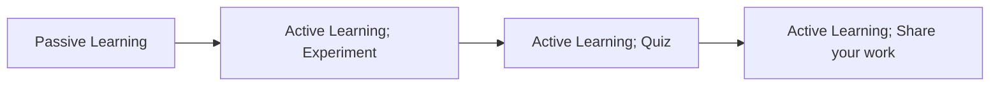
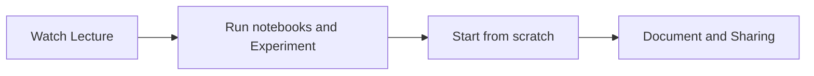

# practical-deep-learning

## How to learn deep learning like a skilled practioner?

This is an overview of how practitioner learns things.

You will see that mostly 80% of the time is **Active Learning!**

Passive learning can be watching lectures or reading articles/text books. But the key important here is you need to quickly get **hands-on** whatever you are learning after you understand at least 20% of the content.

So, the more specificed workflow to this course should look like this:

First, we are going to understand the main concepts or jargon needed on the lesson.

Next, we try it out! Doing an experiment on lecture notebooks and reading their documentation to gain more understanding.

After that, start quizzing yourself, running a notebook from scratch. It's an open-book quize though so you can ask for help like documentation or the forum.

Last, document your work is very important. sharing is neccessary. You can do it in parallel after your passive learning and keep updating it throughout your learning. Doing these will help you retain information over time. They also assist in building your profile to the public -- Showing others what you have done in the past through your work.

From my experience, it can be easy to get lost sometimes. My key takeaway is: **Focus on your end-goal**, **Continue gaining your understanding in a bite-size** and **Be tenacious**.

## References
