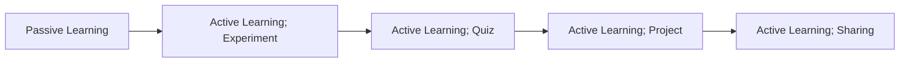
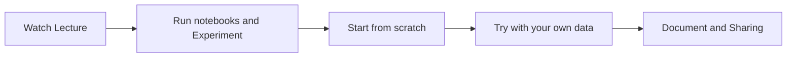

# practical-deep-learning

The key to learn ML/DL is to do any practical things that you care about.

## How to learn deep learning like a skilled practioner?

This is an overview of how practitioner learns things.

You will see that mostly 80% of the time is **Active Learning!**

Passive learning can be watching lectures or reading articles/text books. But the key important here is you need to quickly get **hands-on** whatever you are learning after you understand at least 20% of the content.

So, the more specificed workflow to this course should look like this:

First, by watching a lecture on [Practical Deep Learning for Coders](https://course.fast.ai/), we are going to understand the main concepts or jargons needed on the lesson.

Next, we try it out! Doing an experiment on lecture notebooks and reading their documentation to gain more understanding. This will help strengthen your knowledge together with hands-on experience.

After that, start quizzing yourself, by clearing outputs first then running a notebook in [Deep Learning for Coders with fastai & PyTorch Book](https://course.fast.ai/Resources/book.html) from scratch. It's an open-book quiz though so you can ask for help like browsing through a documentation or posting on the forum. Moreover, while you are running it, document some key ideas apart from the lecture along the way like practical tips.

Then, apply your understanding with mini-project. Find interesting dataset first. The best places to start are [Kaggle Datasets](https://www.kaggle.com/datasets) and [Hugging Face Datasets](https://huggingface.co/datasets). Doing this will help you gain even more experience and make sure you have done something related to your field, driving you to learn deeper.

Last, document your work is very important. sharing is neccessary. You can do it in parallel while you studying passively and keep updating it throughout your learning. Doing these will help you retain information over time. They also assist in building your profile to the public — Showing others what you have done in the past through your work. These simple steps should get you started:

* Documenting with *Quarto*. Use [Quarto Basic](https://github.com/green-nk/quarto-basic) as a guide to start documenting.
* Hosting your documentation as a website on *GitHub Pages*
* Sharing it on social media like *Twitter* or *Linkedin*

In sum, from my experience, it can be easy to get lost sometimes. Keep these 3 things in mind: **Focus on your end-goal**, **Continue gaining your understanding in a bite-size by doing things** and **Be tenacious**.

## References

* [Lesson 0 - Practical Deep Learning for Coders (fast.ai)](https://www.youtube.com/watch?v=gGxe2mN3kAg)
